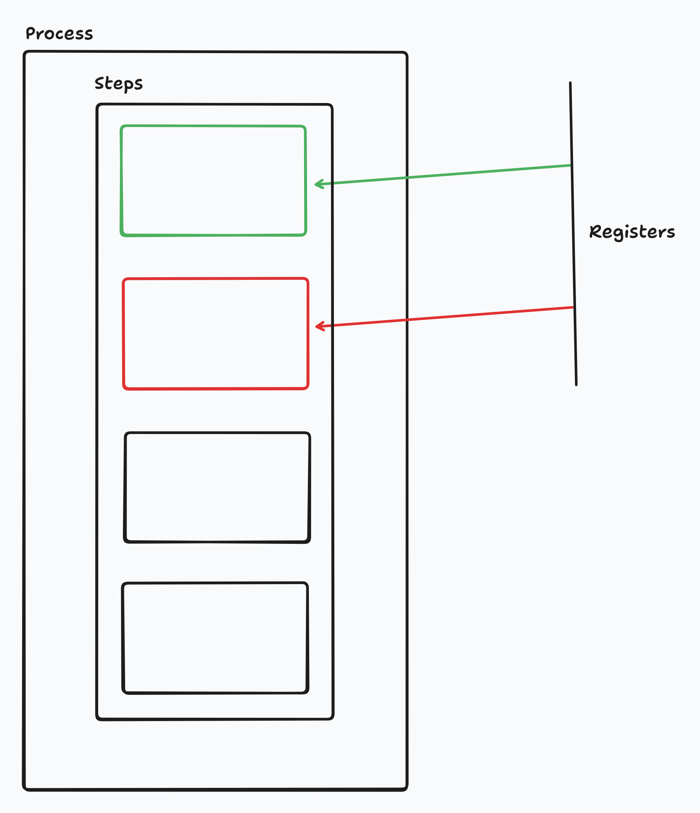

# DRF Audit Trail

A reusable Django DRF application for auditing requests, logins, and custom processes.

---

## Features

- HTTP request auditing (`RequestAuditEvent`)
- Login and logout auditing (`LoginAuditEvent`)
- Structured audit log entries (`AuditLogEntry`)
- Custom process auditing (`ProcessAuditEvent`, `StepAuditEvent`, `RegistrationAuditEvent`)
- Integration with SimpleJWT
- Django Async support
- Thread safe
- Error and stacktrace tracking
- PDF report generation

---

## Installation

```sh
pip install drf-audit-trail
```

---

## Configuration

In your `settings.py`:

```python
INSTALLED_APPS = [
    ...
    "drf_audit_trail",
]

MIDDLEWARE = [
    ...
    "drf_audit_trail.middleware.RequestLoginAuditEventMiddleware",
]
```

### Database

You can use a separate database for audit data:

```python
DATABASES = {
    "default":  {
        "ENGINE": "django.db.backends.sqlite3",
        "NAME": BASE_DIR / "db.sqlite3",
    },
    "audit_trail": {
        "ENGINE": "django.db.backends.sqlite3",
        "NAME": BASE_DIR / "audit_trail.sqlite3",
    },
}

DRF_AUDIT_TRAIL_DATABASE_ALIAS = "audit_trail"  # Audit database alias
DJANGO_DEFAULT_DATABASE_ALIAS = "default"  # Default database alias

DATABASE_ROUTERS = ["drf_audit_trail.database_router.DRFAuditTrail"]
```

---

## Available Settings

Add to your `settings.py` as needed:

```python
DRF_AUDIT_TRAIL_REQUEST_AUDIT_URLS = [r"^(?!/admin/jsi18n/).*$"]  # Monitored URLs (regex)
DRF_AUDIT_TRAIL_AUTH_URL = [
    "/api/token/",
    "/admin/login/",
    "/api/logout/",
    "/admin/logout/",
]  # Authentication endpoints
DRF_AUDIT_TRAIL_AUTH_STATUS_CODE_FAILED = 401  # Auth failure status code
DRF_AUDIT_TRAIL_NOTSAVE_REQUEST_BODY_URLS = ['/api/token']  # Endpoints that do not save request body
DRF_AUDIT_TRAIL_USER_ROLE_GETTER = "drf_audit_trail.utils.get_user_role_by_django_groups"  # Active user role getter
DRF_AUDIT_TRAIL_DEFAULT_SYSTEM_ACTOR_IDENTIFIER = "system"  # Default identifier for system audit events
DRF_AUDIT_TRAIL_DEFAULT_SYSTEM_ACTOR_ROLE = "System"  # Default role for system audit events
DRF_AUDIT_TRAIL_USER_PK_NAME = "pk"  # User PK field name
```

All settings are optional and have sensible defaults.

---

## Audit Models

- **RequestAuditEvent:** HTTP request auditing.
- **LoginAuditEvent:** Login/logout auditing.
- **AuditLogEntry:** Structured, report-friendly audit entries for user or system actions. Entries can be linked to a `RequestAuditEvent` or stored without a request for background/system activity. The audited object is referenced generically with `content_type`, `object_id`, and `object_repr`, so application-specific concepts stay outside the reusable package.
- **ProcessAuditEvent:** Represents the entire process execution.
- **StepAuditEvent:** Represents each step that belongs to the process.
- **RegistrationAuditEvent:** Represents each execution record created during the process flow.

---

## How Process Auditing Works

Process auditing is organized as a hierarchy:

- `ProcessAuditEvent` is the process as a whole.
- `StepAuditEvent` contains all steps that belong to that process.
- `RegistrationAuditEvent` stores each record executed inside the process flow.

This means:

- one process can have many steps
- one step can have many registrations
- each registration tells what happened during the execution of that step

Typical examples of registrations are:

- validation succeeded
- validation failed
- database save completed
- external integration returned an error

The structure below illustrates this relationship:



---

## Example Usage in a View

```python
from rest_framework.views import APIView
from rest_framework.response import Response

class TestAPIView(APIView):
    def get(self, request, *args, **kwargs):
        drf_request_audit_event = request.META.get("drf_request_audit_event")
        drf_request_audit_event["extra_informations"] = {
            "data": "Example of extra information"
        }
        return Response("ok")
```

---

## Example: Structured Audit Log

Use `audit_log` when you need a flat, report-friendly audit entry tied to the current request.
When `old_values` or `new_values` are set, `field_name` must also be provided.
When both `old_values` and `new_values` are set, `reason_for_change` must also
be provided before the audit entry is saved.

```python
from drf_audit_trail.audit_log import audit_log


@audit_log(
    event_type="Update",
    action_description="Updated product price",
    field_name="price",
)
def update_product(request, product_id, audit_log):
    product = Product.objects.get(pk=product_id)
    old_price = product.price

    product.price = request.data["price"]
    product.save()

    audit_log.set_content_object(product)
    audit_log.old_values = str(old_price)
    audit_log.new_values = str(product.price)
    audit_log.reason_for_change = request.data.get("reason_for_change")
    audit_log.extra_informations = {"source": "api"}
```

For multiple field changes, add one entry per changed field:

```python
audit_log.add_field_change(
    field_name="price",
    old_values="10.00",
    new_values="12.00",
    reason_for_change="Correction after review",
)
```

For system actions without a request:

```python
from drf_audit_trail.audit_log import record_system_event

record_system_event(
    event_type="System Action",
    action_description="Auto-save product",
    actor_identifier="system",
    content_object=product,
    field_name="autosaved",
    new_values=True,
)
```

`old_values`, `new_values`, and `extra_informations` are stored in `TextField` columns with JSON serialization. Admin exports format old and new values as human-readable text instead of raw JSON.

If `actor_role` is not set in the decorator or draft, DRF Audit Trail calls `DRF_AUDIT_TRAIL_USER_ROLE_GETTER` to resolve it from the active user. The default getter uses the first Django group assigned to the user. You can configure a custom dotted path; the callable should accept `(user, request=None)`.

### Optional Manager/QuerySet Audit

For projects that prefer model-level auditing without decorating every view, use
`AuditedManager`. This is independent from `@audit_log` and only affects models
that use the audited manager.

The public API is exposed from `drf_audit_trail.manager_audit`. Internally, this
is organized as a package with separate modules for context handling, audited
managers/models, audit planning, snapshots, and audit entry scheduling.

```python
from django.db import models
from django.contrib import admin
from drf_audit_trail.manager_audit import AuditedModel


class Product(AuditedModel):
    FIELD_UPDATE_ACTION_DESCRIPTIONS = {
        "name": "Product name updated",
        "price": "Product price updated",
    }

    name = models.CharField(max_length=255)
    price = models.DecimalField(max_digits=10, decimal_places=2)


@admin.register(Product)
class ProductAdmin(admin.ModelAdmin):
    pass
```

Configure global defaults and optional per-model overrides:

```python
DRF_AUDIT_TRAIL_MANAGER_AUDIT = {
    "enabled": True,
    "default_fields": "__all__",
    "default_exclude_fields": ["created_at", "updated_at"],
    "reason_for_change_key": "reason_for_change",
    "default_reason": None,
    "default_extra_informations_getter": None,
    "default_value_serializer": "raw",  # raw | text | dotted.path.to.callable
    "foreign_key_value_serializer": "repr",  # repr | pk | pk_and_repr
    "file_value_serializer": "name",  # name | path | name_and_path
    "image_value_serializer": "name",  # name | path | name_and_path
    "field_value_serializers": {
        # Optional global per-field override
        # "quantity": "text",
    },
    "default_action_descriptions": {
        "create": "Created object",
        "update": "Updated object",
        "delete": "Deleted object",
    },
    "models": {
        "core.Product": {
            "fields": ["name", "price"],
            "require_reason": False,
            "extra_informations_getter": None,
            "field_value_serializers": {
                # Optional model-specific field overrides
                # "price": "text",
            },
            "action_descriptions": {
                "update": "Updated product",
            },
        }
    },
}
```

Using `AuditedModel` or `AuditedManager` is the opt-in that enables model-level
audit. The `models` setting is only needed for per-model overrides such as
fields, descriptions, reason policy, serializers, or extra information getters.
This feature does not install audit hooks on ordinary Django models.

Models can define `FIELD_UPDATE_ACTION_DESCRIPTIONS` to customize update
descriptions per changed field. Runtime
`audit_model_context(action_description="...")` takes precedence;
fields missing from the model dictionary fall back to configured
`action_descriptions`.

Use `default_extra_informations_getter` or a model-specific
`extra_informations_getter` to populate filter metadata globally. This is useful
for project-specific scopes such as `organization_id`, `sponsor_id`, `study_id`,
or `site_id`.

```python
def audit_scope(*, instance, action, request=None, field_name=None, **kwargs):
    return {
        "organization_id": instance.organization_id,
        "sponsor_id": instance.pk,
        "action": action,
        "field_name": field_name,
    }
```

Getter values are merged with `audit_model_context(extra_informations={...})`
when both are dictionaries. Context values win on duplicate keys.

`old_values` and `new_values` for manager-level update events now store a single
formatted value for the audited field (instead of a JSON object repeating the
field name).

Serializer selection priority for manager-level update values:

1. `models["app.Model"]["field_value_serializers"][field]`
2. global `field_value_serializers[field]`
3. type-level serializer (`image` / `file` / `foreign_key`)
4. `default_value_serializer`

Built-in serializer names:

- Generic: `raw`, `text`
- Relation fields (`ForeignKey`, `OneToOneField`): `repr`, `pk`, `pk_and_repr`
- File/Image fields: `name`, `path`, `name_and_path`

Defaults in this library version:

- `default_value_serializer = "raw"`
- `foreign_key_value_serializer = "repr"`
- `file_value_serializer = "name"`
- `image_value_serializer = "name"`

This means, by default:

- regular scalar fields keep their native type in `old_values_data` /
  `new_values_data` (example: `int`, `bool`, `dict`)
- relations are stored as a user-friendly `repr` (instead of only PK)
- files/images store filename/path value (`name`)

Example with different models and field types:

```python
DRF_AUDIT_TRAIL_MANAGER_AUDIT = {
    "enabled": True,
    "default_fields": "__all__",

    # Global defaults
    "default_value_serializer": "raw",
    "foreign_key_value_serializer": "repr",
    "file_value_serializer": "name",
    "image_value_serializer": "name_and_path",

    # Optional global field-name overrides (applies to any model with this field name)
    "field_value_serializers": {
        "metadata": "text",  # force JSONField/dict to string
    },

    "models": {
        "core.Product": {
            "fields": ["name", "price", "category", "photo", "metadata"],
            "field_value_serializers": {
                "price": "text",          # Decimal as text
                "category": "pk_and_repr", # include pk and repr for FK
                "photo": "path",          # absolute/storage path for image
            },
        },
        "core.Supplier": {
            "fields": ["name", "contract_file"],
            "file_value_serializer": "name_and_path",
        },
    },
}
```

You can also provide a custom callable serializer (callable object or dotted
path import string):

```python
"default_value_serializer": "my_project.audit.serializers.serialize_value"
```

Callable signature:

```python
def serialize_value(*, obj, field, raw_value):
    return ...
```

The same custom serializer strategy can be used in:

- `default_value_serializer`
- `foreign_key_value_serializer`
- `file_value_serializer`
- `image_value_serializer`
- `field_value_serializers`

Use a context when a specific flow needs a custom reason, actor, descriptions, or
field set:

```python
from drf_audit_trail.manager_audit import audit_model_context


with audit_model_context(
    request=request,
    reason_for_change=request.data.get("reason_for_change"),
    action_description="Updated consensus during review",
    model=Product,
    fields=["price"],
):
    Product.objects.filter(pk=product_id).update(price="12.00")
```

For create events, prefer object-level entries without `reason_for_change`;
reserve reasons for updates, deletes, or custom actions where a change needs
business justification.

When no explicit reason is provided, manager-level audit reads the global
`reason_for_change_key` from `request.data`, `request.POST`, or a JSON request
body. The default key is `reason_for_change`. A string applies to every changed
field; a dictionary maps `field_name` to a field-specific reason. This request
fallback only applies to field-level update entries.

`model` accepts a model class, model instance, queryset, manager, or model label.
If the selected model has no configured `fields`, all concrete non-primary-key
fields are tracked, except auto timestamp fields such as `created_at` and
`updated_at`.

`AuditedModel` captures `instance.save()` and `instance.delete()`, so Django
Admin, forms, DRF serializers, and regular application code are covered when they
mutate model instances. Its default manager also captures `create()`,
`get_or_create()`, `update_or_create()`, queryset `update()`, queryset `delete()`,
`bulk_create()`, and `bulk_update()`. It writes one object-level `AuditLogEntry`
for create/delete events without `field_name`, `old_values`, or `new_values`, and
one `AuditLogEntry` per changed field for update events, after
`transaction.on_commit()`. Raw SQL and models that do not inherit the base class
are intentionally outside this layer and can keep using `@audit_log`.

### Audit Log Admin Exports

The Django admin changelist for `AuditLogEntry` includes CSV, XLS, and PDF export buttons. Exports use the currently filtered admin queryset and include who pulled the report, when it was pulled, and the filters applied.

Filters that depend on the consuming application's domain, such as Sponsor, Study, Site, Subject, or Investigator, should be implemented by that application. DRF Audit Trail keeps the reusable model generic and does not add project-specific fields such as `sponsor`, `study`, or `site`.

### Customizing Audit Log Admin Filters

Projects can unregister the default admin and register their own subclass of `AuditLogEntryModelAdmin`.

To expose any stored actor role as a regular Django admin filter:

```python
from django.contrib import admin
from django.contrib.admin.sites import NotRegistered

from drf_audit_trail.admin import AuditLogEntryModelAdmin
from drf_audit_trail.models import AuditLogEntry


try:
    admin.site.unregister(AuditLogEntry)
except NotRegistered:
    pass


@admin.register(AuditLogEntry)
class ProjectAuditLogEntryAdmin(AuditLogEntryModelAdmin):
    list_filter = AuditLogEntryModelAdmin.list_filter + ("actor_role",)
```

To expose only an explicit Investigator role filter:

```python
from django.contrib import admin
from django.contrib.admin import SimpleListFilter
from django.contrib.admin.sites import NotRegistered

from drf_audit_trail.admin import AuditLogEntryModelAdmin
from drf_audit_trail.models import AuditLogEntry


class InvestigatorRoleFilter(SimpleListFilter):
    title = "Role"
    parameter_name = "role"

    def lookups(self, request, model_admin):
        return (("investigator", "Investigator"),)

    def queryset(self, request, queryset):
        if self.value() == "investigator":
            return queryset.filter(actor_role="Investigator")
        return queryset


try:
    admin.site.unregister(AuditLogEntry)
except NotRegistered:
    pass


@admin.register(AuditLogEntry)
class ProjectAuditLogEntryAdmin(AuditLogEntryModelAdmin):
    list_filter = AuditLogEntryModelAdmin.list_filter + (InvestigatorRoleFilter,)
```

---

## Diagrams

> **Note:** These diagrams were created before the latest structured audit log changes.
> They may not be 100% accurate for the current implementation. Until the diagrams
> are updated, use the textual documentation in this README as the source of truth.

### Audit Flow


### ERD


### Middleware Class Diagram


---

## Example: Process Auditing

To audit custom business processes, use the process audit utilities:

```python
from drf_audit_trail.models import (
    ProcessAuditEvent,
    RegistrationAuditEvent,
    StepAuditEvent,
)
from drf_audit_trail.process_audit import ProcessAudit


class CreateProductProcessAudit(ProcessAudit):
    def create_process(self) -> ProcessAuditEvent:
        return self.save_model(ProcessAuditEvent(name="Criar produto"))

    def create_steps(self, process: ProcessAuditEvent):
        self.step_validation = self.save_model(
            StepAuditEvent(
                name="Validação dos Dados",
                order=1,
                process=process,
                total_registrations=2,
            )
        )

        self.step_save_db = self.save_model(
            StepAuditEvent(
                name="Salvar no banco de dados",
                order=2,
                process=process,
            )
        )

    def create_registration_step_validation_code(
        self, success, name=None, **extra_fields
    ):
        name = name or "Codigo do produto validados com sucesso"
        return self.save_model(
            RegistrationAuditEvent(
                name=name, step=self.step_validation, success=success, **extra_fields
            )
        )

    def create_registration_step_validation(self, success, name=None, **extra_fields):
        name = name or "Dados de criação validados com sucesso"
        return self.save_model(
            RegistrationAuditEvent(
                name=name, step=self.step_validation, success=success, **extra_fields
            )
        )

    def create_registration_save_db(self, success, name=None, **extra_fields):
        name = name or "Salvar no banco de dados"
        return self.save_model(
            RegistrationAuditEvent(
                step=self.step_save_db, success=success, name=name, **extra_fields
            )
        )


class ProductViewSet(ModelViewSet):
    serializer_class = ProductSerializer
    queryset = Product.objects.all()

    def create(self, request, *args, **kwargs):
        process_audit = CreateProductProcessAudit(request)

        serializer = self.get_serializer(data=request.data)
        if serializer.is_valid():
            process_audit.create_registration_step_validation_code(True)
            process_audit.create_registration_step_validation(True)
        else:
            if serializer.errors.get("code") is not None:
                process_audit.create_registration_step_validation_code(
                    False,
                    "Error de validação de codigo",
                    description=json.dumps(serializer.errors.get("code")),
                )
            validation_errors = json.dumps(serializer.errors)
            process_audit.create_registration_step_validation(
                False, "Erros de validação", description=validation_errors
            )
            raise ValidationError(serializer.errors)

        try:
            self.perform_create(serializer)
            process_audit.create_registration_save_db(True)
        except BaseException as e:
            process_audit.create_registration_save_db(False, e.__str__())
            raise

        headers = self.get_success_headers(serializer.data)
        return Response(serializer.data, status=201, headers=headers)
```

---

## Handling Long Data and Preventing Database Errors

Starting from version X.X.X, DRF Audit Trail automatically prevents `DataError` (e.g., `StringDataRightTruncation`) when saving audit events, even when request parameters (like URLs or query strings) exceed the database limit.

### How does it work?

- Fields sensitive to length, such as `url` and `query_params` in the `RequestAuditEvent` model, use a custom field that **automatically truncates** values exceeding the database limit (e.g., 2048 characters).
- When truncation occurs, a warning is logged via Python (`drf_audit_trail.truncation`), enabling traceability.
- This ensures the audit middleware **never causes a request to fail** due to oversized data, making the solution robust for public APIs or endpoints with extensive parameters.

### Example of truncation log

```
WARNING drf_audit_trail.truncation: Truncating value for field 'url' to 2048 characters. Original length: 3010.
```

### Notes
- Truncation is transparent to the library user.
- To audit this behavior, set the log level to `WARNING` in the `drf_audit_trail.truncation` logger.
- This behavior applies to all fields of type `TruncatingCharField`.

---

## License

MIT License

---

## Notes

- All settings are optional and have default values.
- For advanced customization, see the code and docstrings.
- For questions, check the docstrings or open an issue.
