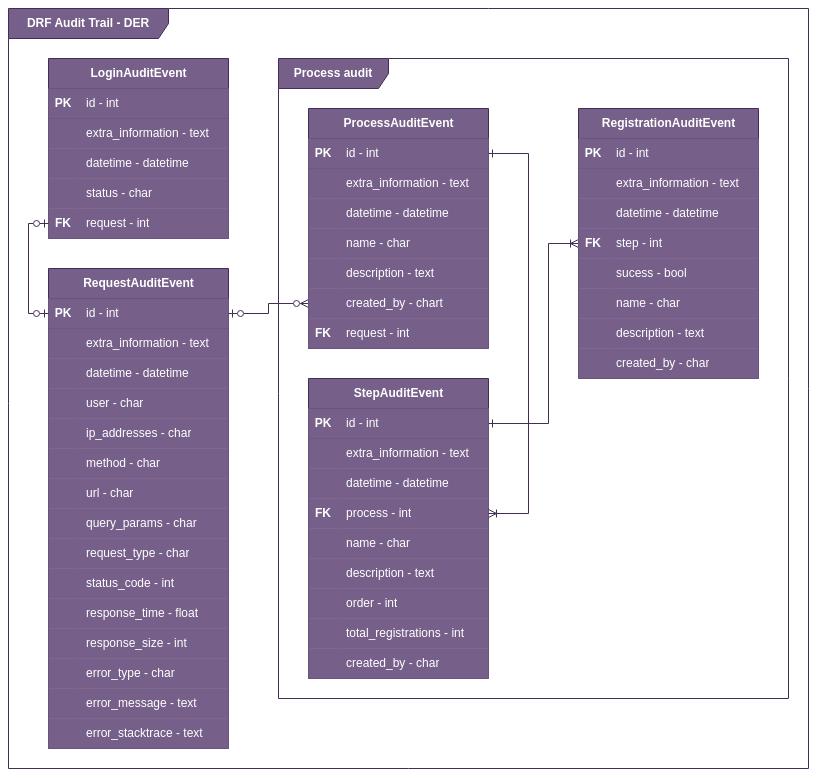
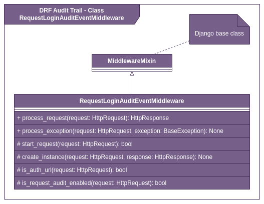

# DRF Audit Trail

A reusable django [DRF] application that handles auditing of requests and logins

## Features

- Request audit trail
- Logins audit trail
- Integration simplejwt

## Usage

Para usar este app, você precisa efetuar a instação do mesmo e logo apos adicionar-lo ao INSTALLED_APPS do Django e configurar o middlewares no array de middlewares do seu django settings

#### Installation
```sh
pip install drf-audit-trail
```

#### Add to Django INSTALLED_APPS configuration
```python
# settings.py

INSTALLED_APPS = [
    ...
    "drf_audit_trail"
]
```

#### Add to Django MIDDLEWARE configuration
```python
# settings.py

MIDDLEWARE = [
    ...
    "drf_audit_trail.middleware.RequestLoginAuditEventMiddleware",
]
```

## Flow


## DER


## RequestLoginAuditEventMiddleware class diagram


